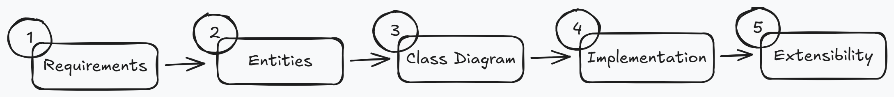

# Plan

## In-hurry
```text
1. Requirements
Find out what-in-scope and what-out-of-scope.

2. Entities & Relationships
Identify the core objects, their responsibilities and relation between them.

3. Class Design
Extend each entities based on requirements, by adding field and methods

4. Implementation
Write code based on priority best way is by Happy Path then Edge Cases

5. Extensibility (Q&A)
Design in a way that future changes can be added cleanly without breaking existing code

```
## Delivery Framework



### 1. Requirents (~5 minutes)

Ask question around this area.

- **Primary capabilities** — What operations must this system support?
- **Rules and completion** — What conditions define success, failure, or when the system stops or transitions state?
- **Error handling** — How should the system respond when inputs or actions are invalid?
- **Scope boundaries** — What areas are in scope (core logic, business rules) and what areas are explicitly out (UI, storage, networking, concurrency, extensibility)?

```text
1. What is the main workflow?
2. What operations are supported?
3. What business rules affect design?
4. What assumptions can I safely make?
5. What is out of scope?
```

```text
Requirements:
1. Two players alternate placing X and O on a 3x3 grid.
2. A player wins by completing a row, column, or diagonal.
3. The game ends in a draw if all nine cells are filled with no winner.
4. Invalid moves should be rejected (placing on an occupied cell, acting after the game is over).
5. The system should provide a way to query current game state and reset the game.

Out of Scope:
- UI/rendering layer
- AI opponent or move suggestions
- Networked multiplayer
- Variable board sizes (NxN grids)
- Undo/redo functionality
```

### 2. Entities and Relationships (~3 minutes)
-  You’re shaping the structure of the system before you worry about the specifics of any one class.
- **Identify Entities**
  - If something maintains changing state or enforces rules, it likely deserves to be its own entity.
  - If it’s just information attached to something else, it’s probably just a field on another class.
  
- **Define Relationships**
  - Which entity is the orchestrator — the one driving the main workflow?
  - Which entities own durable state?
  - How do they depend on each other? (has-a, uses, contains)
  - Where should specific rules logically live?
  
```text
Entities:
- Game
- Board
- Player

Relationships:
- Game -> Board
- Game -> Player (2x)
```

### 3. Class Design (~10-15 minutes)
- Turn each one into an outline of an actual class. This includes what it stores and what it does.

- For each entity, you'll answer two questions:
    - **State** - What does this class need to remember to enforce the requirements?
    - **Behavior** - What does this class need to do, in terms of operations or queries?
  
- Deriving State from Requirements
  
  - Go back to your requirements list and, for each entity, ask:
    - Which parts of the requirements does this entity own?
    - What information does it need to keep in memory to satisfy those responsibilities?
    - Requirement -> What this class must track
  <br>
    - Requirement -> 	What Game must track
      - "Two players alternate placing X and O on a 3x3 grid." -> .The two players, whose turn it is, and the Board
      - "The game ends when a player wins or the board is full." -> Game state (in progress, won, draw) and the winner (if any)
  
```text
Game – State:
class Game:
  - board: Board
  - playerX: Player
  - playerO: Player
  - currentPlayer: Player
  - state: GameState (IN_PROGRESS, WON, DRAW)
  - winner: Player? (null if no winner)

  + makeMove(player, row, col) -> bool
  + getCurrentPlayer() -> Player
  + getGameState() -> GameState
  + getWinner() -> Player?
  + getBoard() -> Board
```
### 4. Implementation (~10 minutes)
- Unless otherwise specified, you should implement the major methods in pseudo-code, as we'll do here.
- Add design pattern if only add value

- **Happy Path**- Walk through the method in a linear way: 
  - what inputs it receives, the sequence of steps it performs, 
  - the internal calls it makes to other classes, and 
  - what it returns or how it changes state. 
  - You want your interviewer to see how the system actually moves.
  
- **Edge Cases**- After the happy path, enumerate the failure modes: 
  - invalid inputs, 
  - illegal operations, 
  - out-of-range values, 
  - calls that violate the current system state—anything that must be rejected or handled gracefully. 
  - This is an important step to demonstrate that you're thinking like someone who writes production code, not just toy logic.
  
```python
makeMove(player, row, col)
    if state != IN_PROGRESS
        return false
    if player != currentPlayer
        return false
    if !board.canPlace(row, col)
        return false

    board.placeMark(row, col, player.mark)

    if board.checkWin(row, col, player.mark)
        state = WON
        winner = player
    else if board.isFull()
        state = DRAW
    else
        currentPlayer = (player == playerX) ? playerO : playerX

    return true
```

- **Verification: Walk Through a Specific Scenario**
- Pick a simple but non-trivial scenario and step through it tick by tick, showing:
  - Initial state
  - What happens on each operation
  - How state changes at each step
  - Edge cases or transitions (like going from in-progress to completed)

```text
Initial: board empty, currentPlayer = X
makeMove(X, 0, 0) → board[0][0] = X, currentPlayer = O
makeMove(O, 1, 1) → board[1][1] = O, currentPlayer = X
...
  ```

### 5. Extensibility
- This part is usually interviewer-led. They'll propose a twist to see whether your design can evolve cleanly, not whether you can bolt on hacks.

- For example, if you're asked "How would you add undo functionality?" you'd point to where state changes happen and explain:
    > " All state transitions flow through a single action method—makeMove in this case. To add undo, I'd introduce a command history stack. Each successful action records the previous state before modifying anything. An undo() method pops the stack, reverts to that state, and the rest of the system doesn't need to change."

### 6. Patterns
- **Resource Allocation**
  - Parking Lot
  - Hotel Booking
  - Cab Booking
- **State Machine**
  - Vending Machine
  - ATM
  - Elevator
- **Inventory / Catalog**
  - Amazon
  - Library Management
  - BookMyShow
- **Scheduling**
  - Meeting Room
  - Calendar
  - Task Scheduler
- **Games**
  - Snake & Ladder
  - Chess
  - Tic Tac Toe

### 7. Links
- [Top 20 Low Level Design Interview Questions](https://www.lowleveldesignmastery.com/blog/low-level-design-interview-questions/)